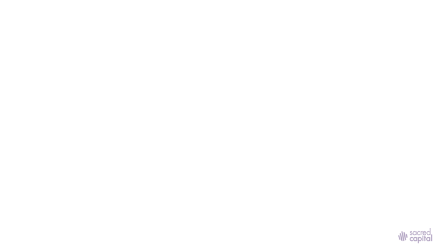

# A Formal Economic Language for Reputation

For more about the project, [view our website](https://www.sacred.capital)

Sacred Capital is building a wealth system that functions contextually, without the need for consensus. Think of it as distributed reputation fabric that underpins the new economy.

## This wealth system is referred to as 'The Reputation Economy'



Our intent, is to facilitate new kinds of engagements through this reputation fabric. As the complexity of these interactions build, we hope that it can operate as a distributed mesh of social intelligence.

