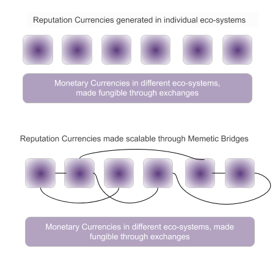

# Reputation Interchange

**Proposal**: The interchange co-ordinates cross-membrane access to reputation data through a consent driven process. In other words, a neighbourhoods, or micro-community can articulate culture using reputation data that is generated across neighbourhoods as well as their own community.  Such an articulation, which requires access to reputation data from another context is called a 'Proposal'.

**Consent**: From an agents perspective the interchange serves as a _switchboard_ that allows them to control their reputation data as they hop across micro-collectives. When an agent enters a new context, they are asked if they would like to allow access to reputation data from another context. An agreement of this nature is termed 'Consent'. 

> The tension generated between a Neighbourhood, and an agent who consents, drives 'contextuality' for such reputation linkages. This tension is similar to demand-supply dynamics that ensure establishment of prices for goods and services in the monetary economy.


It's important to note that the interchange occurs at the level of reputation data, and not on the computed scores. 


This data is ported through established 'memetic bridges' which ensure veracity of data through validation rules.The quality and strength of memetic bridges define how 'trustable' this data is. In that sense, trust remains a 'human problem' that cannot be automated away simply by the use of distributed ledgers.

By enabling agents to gain the benefits of reputation data across communities, we hope to generate 'network effects' for reputation currencies, and in doing so build the foundations of reputation economics. Scalable reputation currencies have the potential to develop radically new organisational structures like 'Neighbourhoods' through multi-dimensional wealth systems.

