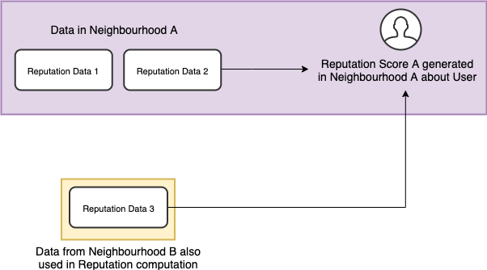
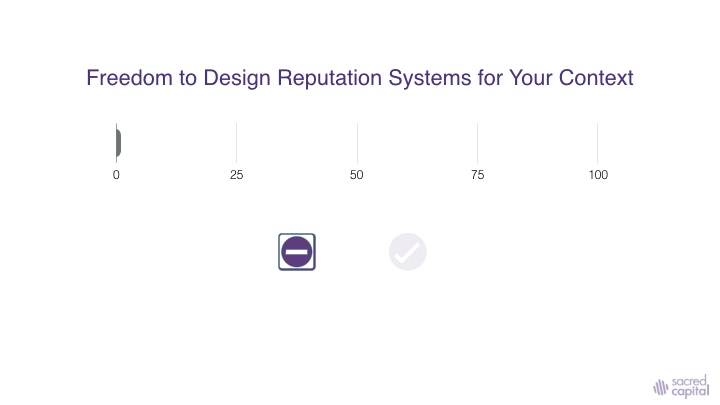
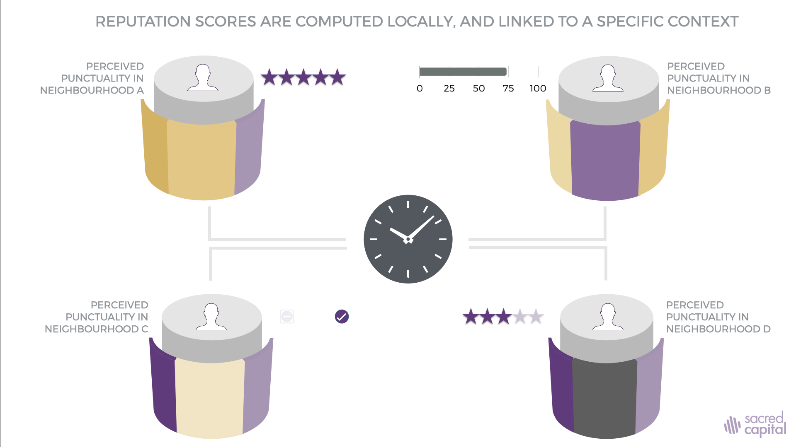

# Reputation Scores

Reputation data from across contexts is computed within a neighbourhood to generate what is known as a 'Reputation Score'. 

> Reputation scores are calculated locally, in a specific neighbourhood or micro-network, which means they are contextual, and not universally imposed as snapshots of absolute reality.

In the case above, Reputation Data from multiple Neighbourhoods is used to compute some sort of Reputation Score in Neighbourhood A, with the user's consent. An example of such a computation may be ascertaining if the user is 'Punctual' using timestamp data. Neighbourhood A may use a binary representation of whether the user is 'Punctual', or 'Not Punctual' based on the timestamps. Neighbourhood B may compute a similar score in its own context, with building blocks that are relevant to them, using a different representation of punctuality. Perhaps they don't believe punctuality is binary, but rather, a 'Star Rating'. 

> Such a computation is available to everyone who runs a query about the user in Neighbourhood A. In a sense, it is a sense-making framework that is imposed upon all members, and hence termed a 'Canonical Perspective'.

A Reputation Score is the result of a mathematical computation on specific Reputation Data within an application. 

$$
Rn = Fn  (D1, D2...Dn)
$$

Where;  Rn = Reputation Score as viewed by all agents in a Neighbourhood about another agent, as well as 

Fn = Mathematical function permissible with data types being operated upon

Dn = Data from Neighbourhood 1,2,3...n consented to by the agent running the query as well AND the agent for whom the query is being run.

In the specific case where a Neighbourhood does NOT import Reputation Data from any other context, or where the agent does not consent to the porting of data from another context, 

$$
Rn = Fn  (D1)
$$

In the specific case where a Neighbourhood proposes to import data from multiple sources, but an agent consents only to the use of Reputation Data from Neighbourhoods 2 and 3

$$
Rn = Fn (D1, D2, D3)
$$

> The computed score is a function of the context. We call this Canonical Perspective, or shared by everyone in the DHT.

As the image below suggests, this perspective isn't held as a universal label. Rather, it is computed locally as a contextual sense-making framework within a neighbourhood.

To facilitate easy articulation of Reputation Scores within a Neighbourhood, Sacred Capital is developing a Domain Specific Language. We also plan on providing easy-to-use templates and distribution curves that further aid this process. More on this to be published later. 

Note: agents will also hold the option of swapping out the 'Canonical Perspective' as suggested by a Neighbourhood, to maintain their own 'lens' on another agent by constructing their own Perspective. This in being achieved in collaboration with the [Perspectivism infrastructure](https://github.com/lucksus/perspectivism) developed by Nicolas Luck.

