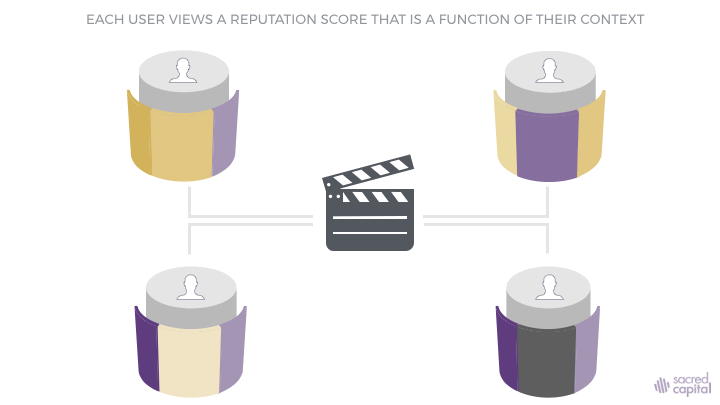
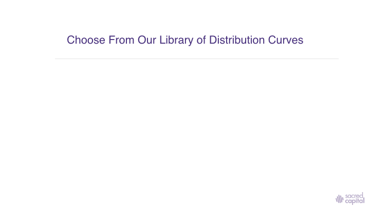

# Reputation Scores

A Reputation Score is the result of a mathematical computation on specific Reputation Data within an application. 

$$
Rn = Fn  (D1, D2...Dn)
$$

Where;  Rn = Reputation Score as viewed by the agent, as well as 

Fn = Mathematical function

Dn = Data from App 1,2,3...n consented to by the agent running the query as well AND the agent for whom the query is being run.

In the specific case where an app does NOT import Reputation Data from any other application, or where the agent does not consent to the porting of data from another app, 

$$
Rn = Fn  (D1)
$$

In the specific case where an app proposes to import data from multiple sources, but an agent consents only to the use of Reputation Data from App 2,

$$
Rn = Fn (D1, D2)
$$

The Result is a highly relative, contextual computation of reputation, which results in situations as described below. The Reputation Interchange \(explained in the previous section\) ensures Reputation Score Computation occurs in alignment with a users context. This involves complex co-ordination by holding the right read permissions for Reputation Data and computing the scores on a users local chain. 

_In cases where agents consent to different sets of stakes - is computation on only the common sets of data. Such cases will be elaborated upon in detail in subsequent versions_

While app-creators may choose from a wide variety of mathematical computations, they must select a design that best resonates most wholesomely with the users within the application. This is critical for developing a meaningful relationship within the context. 

Reputation Scores can be Nominal, Ordinal, Ratios, or Intervals based on their utility within the environment. In certain cases, they may not be displayed, but may have functional utility, in situations where they might be ordering a users feed in a social network, or providing inputs to another level of abstraction like an algorithm. 

We will aid app creators who wish to build on our fabric through an initiative called Reputation Labs. Our Libraries will also provide app-creators a wide variety of templates of distribution curves, to further aid the design process. 

