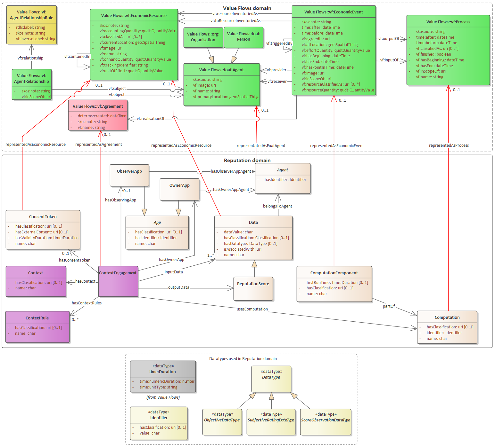

# Value Flows Implementation



## Agents and Resources

**Agent**: A user or a collective of users operating as an economic decision making unit.

_Example:  Individual_

```text
'@id': https://sid.example/
    '@type': foaf:Person
    name: Sid
```

_Example: Organisation/Community/App_

```text
'@id': https://Pospi.example/
    '@type': org:Organization
    name: Pospi's meme making collective
```

**Agent Relationships:** An Agent can be a member of multiple or single Organisations / Communities / Apps

```
'@id': Pospis meme collective:52f0e212-3c4f-4d27-b345-5e964c135824
'@type': AgentRelationshipRole
roleLabel: is member of
inverseRoleLabel: has member
skos:note: Both persons and organizations can be members of this Pospi.Organisa
```

Organisations hold the right to 'Propose' a design for a Reputation Score. Individuals do not. \(See below for more\). Members of an organisation must 'Consent' to their Reputation being staked. \(See below for more\)

**Reputation Data:** An Economic resource that forms an input for Reputation Scores. 

**Reputation Data Types:** A specification of Reputation Data: They can be of two types: Objective and Subjective. See link below.



```text
'@id': timestamp:822b6baf-d66f-45a0-98f2-57450e2aec23
    '@type': Timestamp 
    name: Timestamps
    uri: 
    image: 
    defaultUnit: unit:Time
    resourceClassifiedAs: 
    skos:note: An objective reputation data type the denotes a time stamp
```

```text
'@id': posting:fbff9852-36ca-4364-a943-bc0b49e1cab5
    '@type': EconomicResource
    name: Time of posting comment
    trackingIdentifier: 889jcd00s #unique identifier issued by application
    conformsTo: ose:822b6baf-d66f-45a0-98f2-57450e2aec23
    associated with individual: Pospi
    associated with organisation: Pospi's meme collective 
```

**Reputation Scores:** A mathematical computation executed with Reputation Data as inputs. Reputation Scores can be of a variety of types, but are usually designed to psychologically speak to the person viewing a reputation score. See link below.




## **Processes:**

**Proposal:** An organisation must propose a mathematical function for computing a reputation score by providing reputation data as inputs. Reputation data may be pulled from different organisations. However, if reputation data is being read from an organisation other than the one who is proposing, a member agent's 'consent' is required. 

**Consent:** By default, an organisation calculates reputation scores by using reputation data within the confines of the application. However, if the organisation chooses to import or read reputation data from other organisations, an agent must provide consent. 

Once an agent provides consent, they provide 'observer' status to another agent within the organisation. However, rules of the reputation economy suggest that this other agent only gains observer status to particular reputation data if they have also provided consent for it.  \(Tenet \#4 of the Reputation Economy: Staking\)



**Computation:** When an agent chooses to compute a reputation score for another agent within the organisation, it is done on the basis of the observer status that the agent has. 


